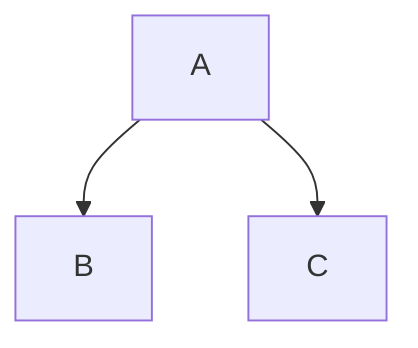

simple text

```python
print("hello world")
```
ou can use the doctest injection to demonstrate execution of Python code in REPL mode:
```doctest
>>> print("hello world")
```
mermaid plugin

```mermaid
graph TD
A --> B
A --> C
```

